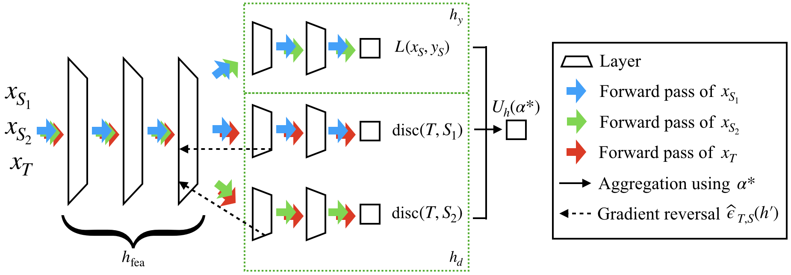

# Domain AggRegation Network (DARN)

PyTorch implementation of the ICML 2020 paper Domain Aggregation Networks for Multi-Source Domain Adaptation. 
Certain codes of this repo are adapted from the [MDAN repo](https://github.com/KeiraZhao/MDAN).
If you have any questions, feel free to email to [junfeng.wen@ualberta.ca](mailto:junfeng.wen@ualberta.ca).

## Prerequisites (Tested Environment)
- Python 3.7.2
- PyTorch 1.4.0
- Numpy 1.18.1
- Matplotlib 3.2.1

## How to Run
To produce the plots of the synthetic regression problem in the paper:
```
python synthetic_regression.py
```

For the real-world problems (Amazon/Digits/Office-Home), 
you need to download the corresponding datasets and put the data files 
in the ``./datasets`` folder.
- Amazon. 
The dataset is available from the [MDAN repo](https://github.com/KeiraZhao/MDAN).
- Digits. (The preprocessing code is in [digits_prepro.py](digits_prepro.py), with some more dependencies.)
  - [MNIST](http://yann.lecun.com/exdb/mnist/), here we use the PyTorch ``.pt`` files. 
  - [SVHN](http://ufldl.stanford.edu/housenumbers/), using the cropped ``.mat`` files.
  - [MNIST-M and SynthDigits](http://yaroslav.ganin.net), using the unpacked version and ``.mat`` files.
- Office-Home. 
To save computation time, the code here is using the pre-trained ResNet-50 features.
You can also try the [original dataset](http://hemanthdv.org/OfficeHome-Dataset/).

To run the experiment
```
python main.py --name='amazon'
```
Then the results will be stored in the ``./results`` folder.
You can also run ``python main.py -h`` to see more options.

To use DARN for other problems, you need to tune the hyperparameters.
Specifically, the following hyperparameters may be important:
- Adversarial loss weight ``--mu``, as suggested by [MDAN](https://github.com/KeiraZhao/MDAN).
- Inverse temperature parameter ``--gamma``. 
As discussed in the paper, the temperature $\tau$ 
balances the weights on different source domains. 
$\gamma=1/\tau$ is the inverse temperature.

## About the L2 Projection
One of the key components is the L2 projection, which is implemented in [module.py](module.py).
The forward pass uses a binary search to find the optimal threshold and saves some essential quantities 
for the backward pass.
The backward pass computes the Jacobian-vector product as described in the appendix of the paper.

## Citation
If you find this repo helpful, please give this repo a star and cite our paper:
```
@inproceedings{wen2020domain,
  title={Domain Aggregation Networks for Multi-Source Domain Adaptation},
  author={Wen, Junfeng and Greiner, Russell and Schuurmans, Dale},
  booktitle={International Conference on Machine Learning},
  pages={10927--10937},
  year={2020}
}
```
